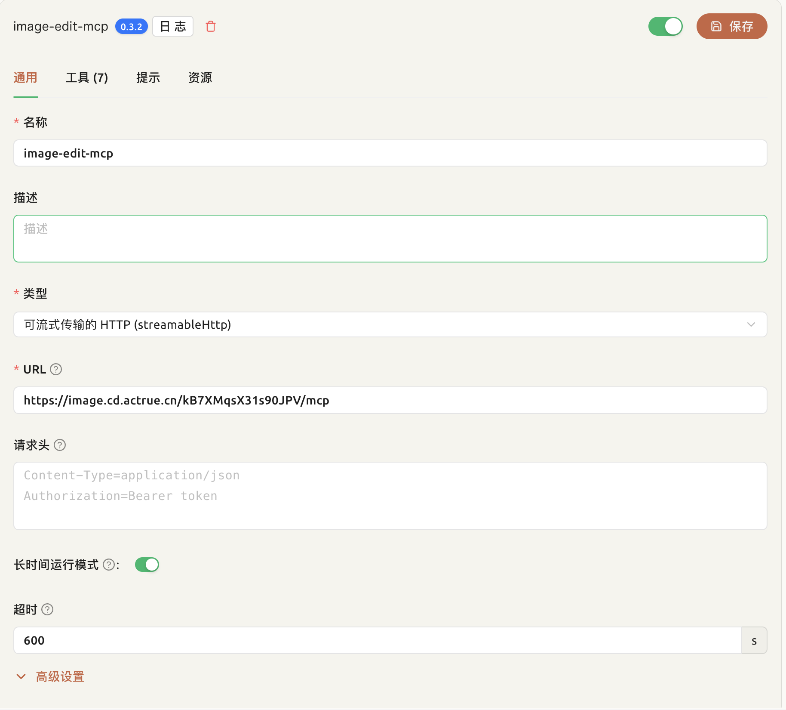
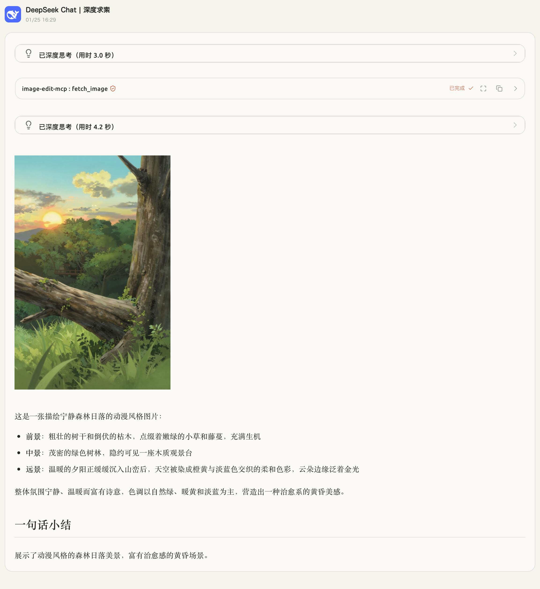
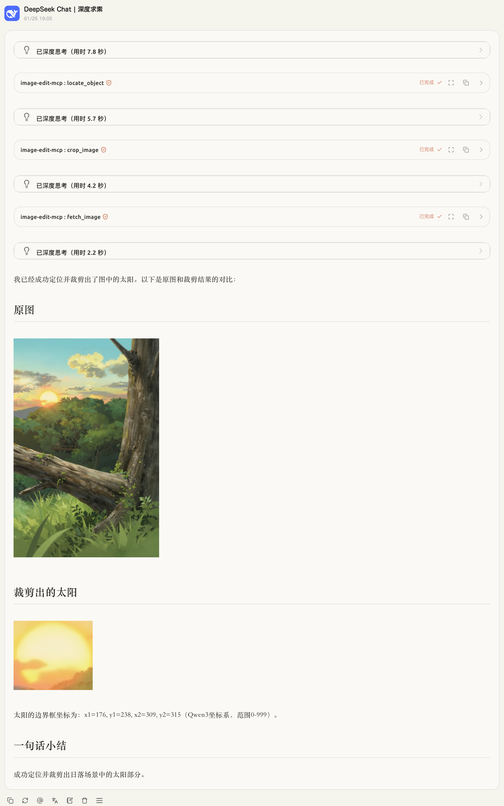

# Image Edit RMCP - Image Editing MCP Service

[中文](README.md) | [English](README_EN.md)

## 1. Project Introduction

1. **Benchmarks OpenAI Web image editing**: Provides an MCP (Model Context Protocol) service similar to OpenAI image editing, supporting multiple image processing operations.
2. **Let text-only models “see images”**: Through image recognition and description, traditional language models can understand and process image content.

## 2. Features

1. **Image processing**:
   - Image content recognition: Use the Qwen3-VL model to analyze image content and generate descriptions
   - Image cropping: Crop by percentage coordinates
   - Image rotation: Supports 90° left, 90° right, and 180° flip
   - Basic image info: Get image dimensions, format, size, and more
   - Image OCR: Extract text content from images
   - AI image generation: Generate images from text prompts
   - AI image editing: Edit existing images based on text instructions

2. **Simple image hosting**: Built-in upload and storage, supports accessing processed images via URL

3. **Secret key generation**: Provides an API key generation and management page

## 3. Demo URLs

- **MCP endpoint**: `https://image.cd.actrue.cn/kB7XMqsX31s90JPV/mcp` (httpstream)
- **Image upload**: `https://image.cd.actrue.cn/kB7XMqsX31s90JPV/upload`
- **Secret key page**: `https://image.cd.actrue.cn/secret`

## 4. Usage Guide

### CherryStudio Integration



**Important**: Enable long-running mode. AI image generation can take a while; please be patient when using it.

### Best Practices

1. Upload the image to be processed via the [image hosting](https://image.cd.actrue.cn/kB7XMqsX31s90JPV/upload) and get the URL
2. Pass the image URL to the model in the prompt

### Image Content Recognition
  

Prompt:
```prompt
https://muse-ai.oss-cn-hangzhou.aliyuncs.com/img/fd7409815bb94bddba84191e21a803a2.png
View this image
```

### Image Cropping
  

Prompt:
```prompt
https://muse-ai.oss-cn-hangzhou.aliyuncs.com/img/fd7409815bb94bddba84191e21a803a2.png
Crop out the sun in the image
Show the original image and the cropped result after cropping
```

### Image Text Extraction
  

Prompt:
```prompt
https://qianwen-res.oss-cn-beijing.aliyuncs.com/Qwen-Image/image2512/arena.png#center
Recognize the text in the image
And display the image
```

## 5. Deployment

### Requirements

- Rust 1.76 or later
- Docker (optional, for container deployment)
- ModelScope API key (for AI features)

### Cargo Deployment (Recommended)

#### 1. Install Rust

```bash
# Install Rust using rustup
curl --proto '=https' --tlsv1.2 -sSf https://sh.rustup.rs | sh

# Or install via system package manager
# macOS: brew install rust
# Ubuntu/Debian: sudo apt install rustc cargo
```

#### 2. Configure Environment Variables

Copy the env template and configure your API key:

```bash
cp .env.example .env
```

Edit `.env`:

```env
# ModelScope API key (required)
MODELSCOPE_API_KEY=your_api_key_here

# Server port
MCP_PORT=3000

# Secret key (used for image upload)
SECRET_KEY=your_secret_key_here

# Cache directory
CACHE_DIR=~/.cache/image-edit-rmcp

# Cache URL (for generating public links)
CACHE_URL=http://localhost:3000
```

#### 3. Start the Project

```bash
# Clone the project (if not yet cloned)
# git clone <repository-url>
# cd image-edit-rmcp

# Install dependencies and build
cargo build --release

# Run the service
cargo run --release
```

The service will start at `http://localhost:3000`.  

Access the MCP service at `http://localhost:3000/{SECRET_KEY}/mcp`.

## 6. Technical Details

### Tool Reference

#### 1. `fetch_image` - Fetch image from URL

**Description**: Download an image from a URL, analyze content, and generate a description.

**Inputs**:
- `url` (string): Image URL (required)
- `focus` (string, optional): Content to focus on

**Outputs**:
- Image URL
- Image name
- MIME type
- Image description text

#### 2. `rotate_image` - Rotate image

**Description**: Rotate an image in the specified direction.

**Inputs**:
- `url` (string): Image URL (required)
- `direction` (enum): Rotation direction:
  - `Right90`: rotate clockwise 90°
  - `Left90`: rotate counterclockwise 90°
  - `Flip180`: rotate 180°

**Outputs**:
- Rotated image URL (PNG format)

#### 3. `crop_image` - Crop image

**Description**: Crop by percentage coordinates.

**Inputs**:
- `url` (string): Image URL (required)
- `left` (float, optional): left percentage (0-100), default 0
- `top` (float, optional): top percentage (0-100), default 0
- `right` (float, optional): right percentage (0-100), default 100
- `bottom` (float, optional): bottom percentage (0-100), default 100

**Outputs**:
- Cropped image URL (PNG format)

#### 4. `get_image_info` - Get image info

**Description**: Retrieve basic image information.

**Inputs**:
- `url` (string): Image URL (required)

**Outputs**:
- `width`: width (pixels)
- `height`: height (pixels)
- `total_pixels`: total pixels
- `mime_type`: MIME type
- `size`: file size (bytes)
- `aspect_ratio`: aspect ratio (optional)

#### 5. `ocr_extract` - OCR text extraction

**Description**: Extract text content from an image.

**Inputs**:
- `image_url` (string): Image URL (required)

**Outputs**:
- Extracted text

#### 6. `generate_image` - AI image generation

**Description**: Generate an image from a text prompt.

**Inputs**:
- `prompt` (string): Image description (required)
- `negative_prompt` (string, optional): Content to avoid
- `aspect_ratio` (string, optional): `1:1`, `16:9`, `9:16`, `4:3`, `3:4`, `3:2`, `2:3` (default `1:1`)
- `resolution` (string, optional): `1k`, `2k`, `4k` (default `1k`)
- `steps` (u32, optional): Sampling steps

**Outputs**:
- Generated image URL

#### 7. `edit_image` - AI image editing

**Description**: Edit an existing image based on text instructions.

**Inputs**:
- `image_url` (string): Image URL to edit (required)
- `prompt` (string): Editing instruction (required)
- `size` (string, optional): Output image size
- `steps` (u32, optional): Sampling steps

**Outputs**:
- Edited image URL

### Implementation Details

#### Tech Stack

- **Backend framework**: Rust + Axum + RMCP
- **Image processing**: `image` crate (supports PNG, JPEG, GIF, BMP, WebP)
- **AI integration**: ModelScope API (Qwen3-VL, Z-Image-Turbo, Qwen-Image-Edit)
- **Cache system**: Local file cache with HTTP access
- **Web UI**: Axum static file service + HTML templates

#### Core Principles

1. **Image processing flow**:
   - Receive HTTP URL input
   - Download image into memory
   - Decode and process with the `image` crate (rotate, crop)
   - Encode output as PNG
   - Cache results in local filesystem

2. **AI features integration**:
   - **Image recognition**: Call ModelScope Qwen3-VL to analyze image content
   - **OCR extraction**: Use Qwen3-VL to extract text from images
   - **Image generation**: Use Z-Image-Turbo to generate images from text
   - **Image editing**: Use Qwen-Image-Edit to edit images based on instructions

3. **Caching**:
   - Compute hash from URL and parameters
   - Store processed results in the local cache directory
   - Serve cached files via HTTP
   - Support metadata storage (image info, descriptions, etc.)

4. **MCP protocol integration**:
   - Implement RMCP protocol ServerHandler
   - Provide standard tool-call interfaces
   - Support httpstream transport

#### Dependencies

Main dependencies (see `Cargo.toml`):
- `rmcp`: MCP protocol implementation
- `axum`: Web framework
- `image`: Image processing
- `reqwest`: HTTP client
- `serde`: JSON serialization
- `tokio`: Async runtime
