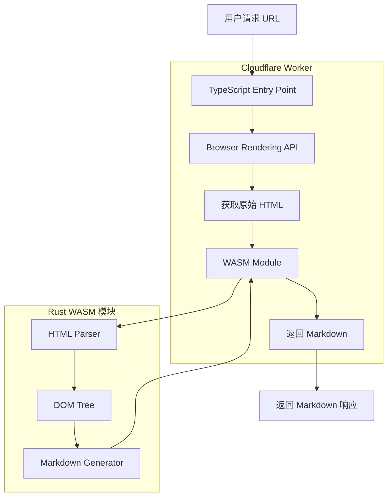
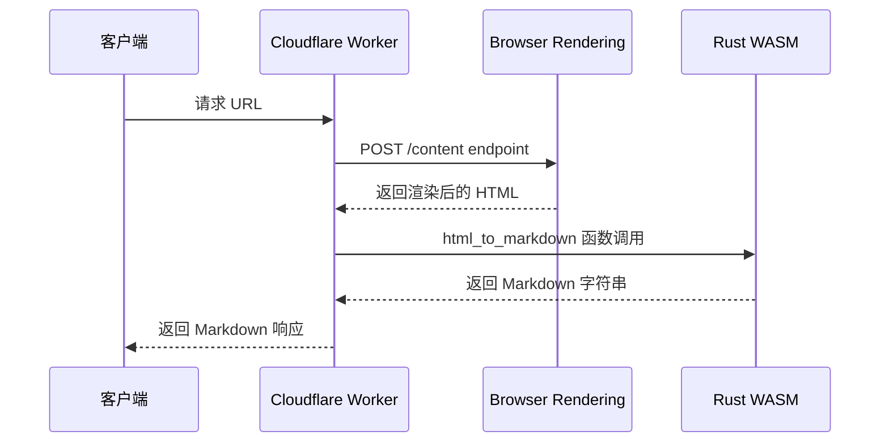
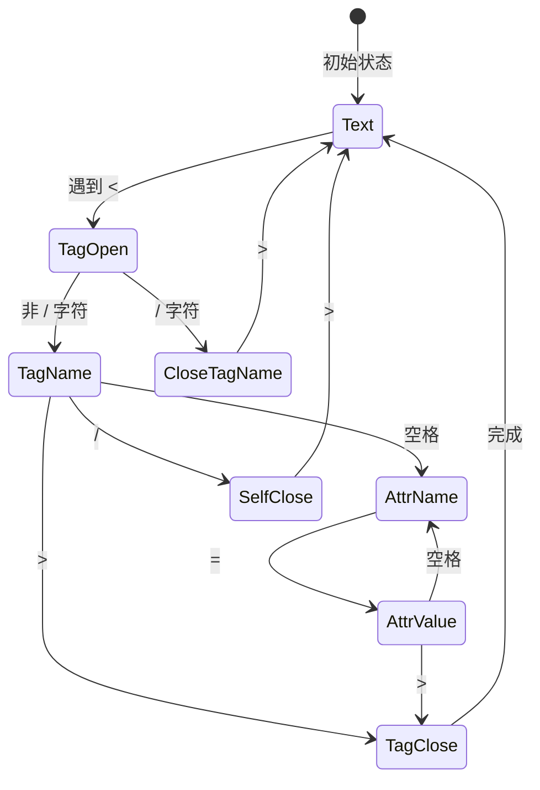
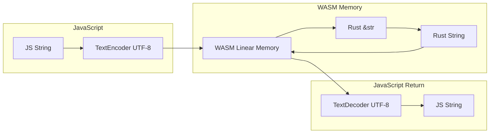

# HTML 到 Markdown 转换架构设计

## 1. 整体架构概览

本项目将重构现有的 `experimental-fetch-markdown.ts`，从使用 Cloudflare Browser Rendering REST API 直接获取 Markdown，改为：

1. 使用 Cloudflare Browser Rendering 获取渲染完成的原始 HTML
2. 使用 Rust 编译的 WASM 模块进行 HTML→Markdown 转换

### 1.1 架构图



### 1.2 数据流



## 2. HTML→Markdown 转换算法设计

### 2.1 支持的 HTML 元素

| 类别 | HTML 元素 | Markdown 输出 |
|------|-----------|---------------|
| 标题 | `<h1>` - `<h6>` | `#` - `######` |
| 段落 | `<p>` | 普通文本 + 空行 |
| 换行 | `<br>` | 两个空格 + 换行 |
| 粗体 | `<strong>`, `<b>` | `**text**` |
| 斜体 | `<em>`, `<i>` | `*text*` |
| 删除线 | `<del>`, `<s>`, `<strike>` | `~~text~~` |
| 行内代码 | `<code>` | `` `code` `` |
| 链接 | `<a href>` | `[text](url)` |
| 图片 | `` | `` |
| 无序列表 | `<ul><li>` | `- item` |
| 有序列表 | `<ol><li>` | `1. item` |
| 代码块 | `<pre><code>` | ``` ` ` ` code ` ` ` ``` |
| 引用 | `<blockquote>` | `> text` |
| 水平线 | `<hr>` | `---` |
| 表格 | `<table><tr><td>` | `| cell |` 格式 |
| 分区 | `<div>`, `<section>`, `<article>` | 递归处理子元素 |
| 忽略 | `<script>`, `<style>`, `<head>`, `<noscript>` | 跳过 |

### 2.2 HTML 解析策略（无外部库）

采用状态机模式手写 HTML 解析器：



#### 2.2.1 解析器核心数据结构

```rust
/// HTML 节点类型
enum HtmlNode {
    /// 元素节点
    Element {
        tag: String,
        attrs: Vec<Attr>,
        children: Vec<HtmlNode>,
    },
    /// 文本节点
    Text(String),
}

/// HTML 属性
struct Attr {
    name: String,
    value: String,
}

/// 解析器状态
enum ParserState {
    Text,
    TagOpen,
    TagName,
    CloseTagName,
    AttrName,
    AttrValueStart,
    AttrValueQuoted,
    AttrValueUnquoted,
    SelfClosing,
}
```

#### 2.2.2 解析流程

1. **词法分析**：逐字符扫描，根据状态机识别标签、属性、文本
2. **构建 DOM 树**：使用栈结构维护嵌套关系
3. **处理自闭合标签**：`<br>`, `<hr>`, `` 等
4. **HTML 实体解码**：`&amp;` → `&`, `&lt;` → `<` 等

### 2.3 Markdown 生成策略

```rust
/// 转换上下文
struct ConvertContext {
    /// 当前缩进级别
    indent_level: usize,
    /// 是否在列表中
    in_list: bool,
    /// 列表类型栈
    list_stack: Vec<ListType>,
    /// 是否在代码块中
    in_code_block: bool,
    /// 是否在表格中
    in_table: bool,
}

enum ListType {
    Ordered(usize),  // 有序列表，包含当前序号
    Unordered,       // 无序列表
}
```

#### 2.3.1 转换规则

```rust
fn convert_node(node: &HtmlNode, ctx: &mut ConvertContext) -> String {
    match node {
        HtmlNode::Text(text) => process_text(text, ctx),
        HtmlNode::Element { tag, attrs, children } => {
            match tag.to_lowercase().as_str() {
                "h1" => format!("# {}\n\n", convert_children(children, ctx)),
                "h2" => format!("## {}\n\n", convert_children(children, ctx)),
                // ... 其他标签处理
                "a" => {
                    let href = get_attr(attrs, "href").unwrap_or_default();
                    let text = convert_children(children, ctx);
                    format!("[{}]({})", text, href)
                }
                // ... 更多规则
                _ => convert_children(children, ctx),
            }
        }
    }
}
```

### 2.4 边界情况处理

| 边界情况 | 处理策略 |
|----------|----------|
| 嵌套列表 | 使用缩进级别追踪，每层增加 2 空格 |
| 空元素 | 跳过空的 `<p>`, `<div>` 等 |
| 嵌套格式 | 正确处理 `<strong><em>text</em></strong>` → `***text***` |
| 不闭合标签 | 使用栈自动修复 |
| 表格不规则 | 统计最大列数，补齐缺失单元格 |
| 长文本换行 | 保留原始换行，清理多余空白 |
| HTML 注释 | 忽略 `<!-- ... -->` |
| CDATA | 作为纯文本处理 |
| 畸形 HTML | 尽力解析，不抛出错误 |

## 3. WASM 接口设计

### 3.1 Rust 暴露给 JS 的函数

```rust
use wasm_bindgen::prelude::*;

/// 将 HTML 字符串转换为 Markdown
/// 
/// # 参数
/// - `html`: 输入的 HTML 字符串
/// 
/// # 返回
/// - 转换后的 Markdown 字符串
#[wasm_bindgen]
pub fn html_to_markdown(html: &str) -> String {
    let dom = parse_html(html);
    convert_to_markdown(&dom)
}

/// 带选项的 HTML 到 Markdown 转换
/// 
/// # 参数
/// - `html`: 输入的 HTML 字符串
/// - `options`: JSON 格式的选项字符串
/// 
/// # 返回
/// - 转换后的 Markdown 字符串
#[wasm_bindgen]
pub fn html_to_markdown_with_options(html: &str, options: &str) -> String {
    let opts: ConvertOptions = parse_options(options);
    let dom = parse_html(html);
    convert_to_markdown_with_options(&dom, &opts)
}

/// 转换选项
struct ConvertOptions {
    /// 是否保留空行
    preserve_empty_lines: bool,
    /// 代码块默认语言
    default_code_language: Option<String>,
    /// 是否转换表格
    convert_tables: bool,
}
```

### 3.2 TypeScript 调用接口

```typescript
// 导入 WASM 模块
import init, { html_to_markdown, html_to_markdown_with_options } from '../rust/pkg';

// 初始化 WASM
await init();

// 基本用法
const markdown = html_to_markdown(htmlString);

// 带选项用法
const options = JSON.stringify({
    preserve_empty_lines: true,
    default_code_language: "javascript",
    convert_tables: true
});
const markdown = html_to_markdown_with_options(htmlString, options);
```

### 3.3 数据传递方式

wasm-bindgen 会自动处理 `&str` 和 JavaScript `string` 之间的转换：

1. **JS → WASM**：wasm-bindgen 将 JS string 编码为 UTF-8，复制到 WASM 线性内存
2. **WASM → JS**：Rust 返回的 String 被编码为 UTF-8，wasm-bindgen 将其转换回 JS string



## 4. Rust 项目配置

### 4.1 Cargo.toml 配置

```toml
[package]
name = "html-to-markdown"
version = "0.1.0"
edition = "2021"

[lib]
crate-type = ["cdylib", "rlib"]

[dependencies]
wasm-bindgen = "0.2"

[profile.release]
# 优化 WASM 大小
opt-level = "s"
lto = true
codegen-units = 1
panic = "abort"

[package.metadata.wasm-pack.profile.release]
wasm-opt = ["-Os", "--enable-mutable-globals"]
```

### 4.2 构建命令

```bash
# 安装 wasm-pack
cargo install wasm-pack

# 构建 WASM
wasm-pack build --target web --release

# 输出目录结构
# rust/pkg/
# ├── html_to_markdown_bg.wasm
# ├── html_to_markdown_bg.wasm.d.ts
# ├── html_to_markdown.d.ts
# ├── html_to_markdown.js
# └── package.json
```

### 4.3 Cloudflare Worker 集成

在 `wrangler.jsonc` 中添加 WASM 绑定：

```jsonc
{
    // ... 现有配置
    "wasm_modules": {
        "HTML_TO_MD_WASM": "rust/pkg/html_to_markdown_bg.wasm"
    }
}
```

或者使用 ES 模块方式直接导入：

```typescript
// src/wasm-loader.ts
import wasmModule from '../rust/pkg/html_to_markdown_bg.wasm';
import { initSync, html_to_markdown } from '../rust/pkg/html_to_markdown';

// 初始化 WASM 模块
initSync(wasmModule);

export { html_to_markdown };
```

## 5. 文件结构规划

```
ScrapeCleanMcp/
├── src/
│   ├── index.ts                      # 主入口
│   ├── experimental-fetch-markdown.ts # 重构后使用 WASM
│   ├── wasm-loader.ts                # WASM 加载器
│   └── browner.ts                    # Puppeteer 相关
├── rust/
│   ├── Cargo.toml                    # Rust 项目配置
│   ├── src/
│   │   ├── lib.rs                    # WASM 入口
│   │   ├── parser.rs                 # HTML 解析器
│   │   ├── converter.rs              # Markdown 转换器
│   │   └── entities.rs               # HTML 实体解码
│   └── pkg/                          # wasm-pack 输出目录
│       ├── html_to_markdown_bg.wasm
│       └── html_to_markdown.js
├── docs/
│   └── html-to-markdown-architecture.md  # 本文档
└── wrangler.jsonc                    # Worker 配置
```

## 6. 实现优先级

1. **Phase 1**: 基础 HTML 解析器（标签、属性、文本节点）
2. **Phase 2**: 核心 Markdown 转换（标题、段落、链接、图片、列表）
3. **Phase 3**: 高级功能（表格、代码块、嵌套格式）
4. **Phase 4**: TypeScript 集成和测试

## 7. 性能考虑

- WASM 二进制大小目标：< 50KB（gzip 后）
- 使用 `opt-level = "s"` 优化大小
- 避免不必要的内存分配
- 使用字符串切片而非克隆

## 8. 测试策略

- 单元测试：每个 HTML 元素的转换规则
- 集成测试：完整 HTML 文档转换
- 边界测试：畸形 HTML、空输入、超长输入
- 性能测试：大型文档转换时间
