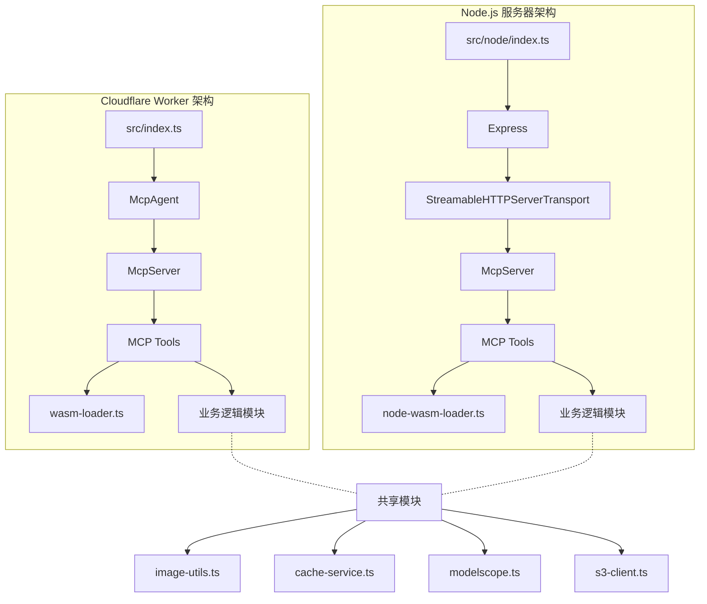

# Node.js MCP 服务器架构设计

## 1. 架构概述

本文档描述如何在保留现有 Cloudflare Worker 代码的基础上，新增一个可在 Node.js 环境运行的 MCP 服务器。

### 1.1 设计原则

- **最小改动**：尽量新增文件，不修改现有 Cloudflare Worker 逻辑
- **代码复用**：复用现有的工具函数和业务逻辑
- **环境隔离**：Node.js 和 Cloudflare Worker 使用各自的入口和适配层

### 1.2 架构对比



## 2. 文件结构

### 2.1 新增文件

```
src/
├── node/                          # Node.js 专用目录
│   ├── index.ts                   # Node.js 服务器入口
│   ├── server.ts                  # MCP 服务器配置和工具注册
│   ├── node-wasm-loader.ts        # Node.js 专用 WASM 加载器
│   └── env.ts                     # 环境变量加载和类型定义
├── shared/                        # 共享工具注册逻辑（可选重构）
│   └── tools.ts                   # 提取的 MCP 工具注册逻辑
├── index.ts                       # Cloudflare Worker 入口（保持不变）
├── image-utils.ts                 # 共享
├── cache-service.ts               # 共享
├── modelscope.ts                  # 共享
├── s3-client.ts                   # 共享
└── wasm-loader.ts                 # Cloudflare 专用（保持不变）

.env.example                       # 环境变量示例文件
```

### 2.2 文件职责说明

| 文件 | 职责 |
|------|------|
| `src/node/index.ts` | Node.js 服务器入口，启动 Express 服务器，处理 HTTP 请求 |
| `src/node/server.ts` | 创建和配置 McpServer，注册所有 MCP 工具 |
| `src/node/node-wasm-loader.ts` | Node.js 环境下加载 WASM 模块 |
| `src/node/env.ts` | 使用 dotenv 加载环境变量，定义环境变量类型 |
| `.env.example` | 环境变量配置示例 |

## 3. 依赖清单

### 3.1 新增生产依赖

```json
{
  "dependencies": {
    "dotenv": "^16.4.5",
    "express": "^5.0.1"
  }
}
```

> 注意：`@modelcontextprotocol/sdk` 已包含 Express 和 StreamableHTTPServerTransport 支持

### 3.2 新增开发依赖

```json
{
  "devDependencies": {
    "@types/express": "^5.0.0",
    "@types/node": "^22.0.0",
    "tsx": "^4.19.0",
    "nodemon": "^3.1.0"
  }
}
```

### 3.3 package.json 脚本命令

```json
{
  "scripts": {
    "dev:node": "nodemon --watch src --ext ts --exec 'tsx src/node/index.ts'",
    "start:node": "tsx src/node/index.ts"
  }
}
```

## 4. 实现细节

### 4.1 Node.js 入口文件 - src/node/index.ts

```typescript
import 'dotenv/config';
import express from 'express';
import { randomUUID } from 'node:crypto';
import { StreamableHTTPServerTransport } from '@modelcontextprotocol/sdk/server/streamableHttp.js';
import { createMcpServer } from './server.js';
import { getEnv } from './env.js';

const app = express();
app.use(express.json());

// 存储会话传输
const transports = new Map<string, StreamableHTTPServerTransport>();

app.all('/mcp', async (req, res) => {
  const sessionId = req.headers['mcp-session-id'] as string | undefined;
  
  let transport: StreamableHTTPServerTransport;
  
  if (sessionId && transports.has(sessionId)) {
    transport = transports.get(sessionId)!;
  } else {
    transport = new StreamableHTTPServerTransport({
      sessionIdGenerator: () => randomUUID(),
      onsessioninitialized: (id) => {
        transports.set(id, transport);
      },
      onclose: () => {
        if (sessionId) transports.delete(sessionId);
      }
    });
    
    const env = getEnv();
    const server = createMcpServer(env);
    await server.connect(transport);
  }
  
  await transport.handleRequest(req, res, req.body);
});

const PORT = process.env.PORT || 3000;
app.listen(PORT, () => {
  console.log(`MCP Server running on http://localhost:${PORT}/mcp`);
});
```

### 4.2 Node.js WASM 加载器 - src/node/node-wasm-loader.ts

```typescript
import { readFile } from 'node:fs/promises';
import { join, dirname } from 'node:path';
import { fileURLToPath } from 'node:url';
import init, {
  get_cropped_dimensions,
  get_rotated_dimensions,
  html_to_markdown,
  crop_pixels,
  rotate_pixels,
} from '../../rust/pkg/html_to_markdown.js';

const __dirname = dirname(fileURLToPath(import.meta.url));
let initialized = false;

export async function ensureWasmReady(): Promise<void> {
  if (!initialized) {
    const wasmPath = join(__dirname, '../../rust/pkg/html_to_markdown_bg.wasm');
    const wasmBuffer = await readFile(wasmPath);
    await init({ module_or_path: wasmBuffer });
    initialized = true;
  }
}

// 导出相同的接口
export { html_to_markdown as htmlToMarkdown };
export function rotatePixels(pixels: Uint8Array, width: number, height: number, angle: number): Uint8Array {
  return rotate_pixels(pixels, width, height, angle);
}
// ... 其他函数同理
```

### 4.3 环境变量配置 - src/node/env.ts

```typescript
export interface NodeEnv {
  modelscope_api_key?: string;
  S3_HOST?: string;
  S3_ID?: string;
  S3_key?: string;
  S3_BUCKET?: string;
  PORT?: string;
}

export function getEnv(): NodeEnv {
  return {
    modelscope_api_key: process.env.modelscope_api_key,
    S3_HOST: process.env.S3_HOST,
    S3_ID: process.env.S3_ID,
    S3_key: process.env.S3_key,
    S3_BUCKET: process.env.S3_BUCKET,
    PORT: process.env.PORT,
  };
}
```

### 4.4 .env.example 示例

```env
# MCP Server Port
PORT=3000

# ModelScope API
modelscope_api_key=your_api_key_here

# S3 Configuration
S3_HOST=your_s3_host
S3_ID=your_access_key_id
S3_key=your_secret_key
S3_BUCKET=your_bucket_name
```

## 5. 关键架构决策

### 5.1 WASM 加载差异

| 环境 | WASM 加载方式 |
|------|---------------|
| Cloudflare Worker | 通过 wrangler 内置的 WASM 模块导入 |
| Node.js | 使用 fs 读取 WASM 文件后初始化 |

### 5.2 环境变量差异

| 环境 | 环境变量来源 |
|------|--------------|
| Cloudflare Worker | wrangler.jsonc 或 .dev.vars |
| Node.js | .env 文件通过 dotenv 加载 |

### 5.3 传输层差异

| 环境 | 传输方式 |
|------|----------|
| Cloudflare Worker | McpAgent + Durable Objects |
| Node.js | Express + StreamableHTTPServerTransport |

## 6. 实现步骤

1. **安装新依赖**
   ```bash
   pnpm add dotenv express
   pnpm add -D @types/express @types/node tsx nodemon
   ```

2. **创建 src/node 目录结构**

3. **实现 env.ts** - 环境变量加载

4. **实现 node-wasm-loader.ts** - Node.js WASM 加载器

5. **实现 server.ts** - MCP 服务器和工具注册
   - 从 src/index.ts 提取工具注册逻辑
   - 适配环境变量传递方式

6. **实现 index.ts** - Express 服务器入口

7. **创建 .env.example** - 环境变量示例

8. **更新 package.json** - 添加脚本命令

9. **更新 tsconfig.json** - 确保包含 src/node 目录

## 7. 运行方式

### 开发模式（支持热重载）
```bash
pnpm dev:node
```

### 生产模式
```bash
pnpm start:node
```

### 测试连接
```bash
curl -X POST http://localhost:3000/mcp \
  -H "Content-Type: application/json" \
  -d '{"jsonrpc": "2.0", "method": "initialize", "params": {"protocolVersion": "2024-11-05", "capabilities": {}, "clientInfo": {"name": "test", "version": "1.0.0"}}, "id": 1}'
```
