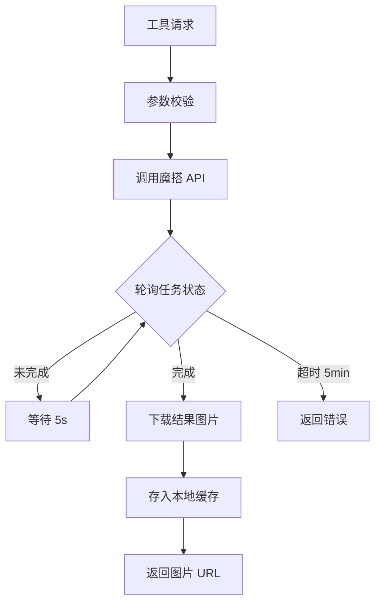

# 功能树

## 1. 功能目录

- **MCP 服务器** — 基于 rmcp 0.14.0 的 Streamable HTTP MCP 服务
  - fetch_image — 从 URL 列表并发获取图像
  - rotate_image — 旋转图像（90°/-90°/180°）
  - crop_image — 裁剪图像
  - ocr_extract — OCR 文字提取（支持并发）
  - locate_object — 定位图像中物体（边界框坐标）
  - generate_image — AI 生成图像（魔搭 Z-Image-Turbo）
  - edit_image — AI 编辑图像（魔搭 Qwen-Image-Edit）
- **Web 页面** — Axum HTTP 服务
  - /mcp — MCP 协议入口
  - /upload — 图片上传页面
  - /secret — 密钥配置页面
  - /cache — 缓存文件静态服务
- **魔搭 API 集成** — ModelScope API 对接
  - 图片描述/OCR（Qwen3-VL-8B-Instruct）
  - 图片生成（Z-Image-Turbo）
  - 图片编辑（Qwen-Image-Edit-2511）
- **本地图像处理** — 基于 image crate 的像素级操作
- **缓存系统** — 本地文件存储、元数据管理、哈希计算

## 2. 核心功能实现流程图

```mermaid
flowchart TD
    Client[MCP 客户端] -->|Streamable HTTP| MCP[/mcp 端点]
    MCP --> Router[ToolRouter - 7个工具]
    Router --> FetchImg[fetch_image]
    Router --> RotateImg[rotate_image]
    Router --> CropImg[crop_image]
    Router --> OCR[ocr_extract]
    Router --> Locate[locate_object]
    Router --> GenImg[generate_image]
    Router --> EditImg[edit_image]

    FetchImg --> ModelScope[魔搭 API]
    OCR --> ModelScope
    Locate --> ModelScope
    GenImg --> ModelScope
    EditImg --> ModelScope

    FetchImg --> ImgProc[image_processing]
    RotateImg --> ImgProc
    CropImg --> ImgProc

    ModelScope --> Cache[cache 本地存储]
    ImgProc --> Cache
    Cache -->|返回 URL| Client
```

## 3. 核心功能实现文字说明

- **入口**：`main.rs` 启动 Axum HTTP 服务器，读取环境变量配置端口、密钥、缓存目录等
- **MCP 服务**：`mcp_server.rs` 中 `ImageEditorServer` 通过 `#[tool_router]` 宏注册 7 个工具，通过 `#[tool_handler]` 宏实现 `ServerHandler` trait
- **工具调度**：每个工具接收 `Parameters<XXXRequest>` 参数，调用 `modelscope` 或 `image_processing` 模块处理，结果存入 `cache`，返回 `CallToolResult`
- **魔搭 API**：`modelscope.rs` 封装异步轮询机制（间隔 5s，超时 5min），对接 ModelScope 推理 API
- **缓存**：`cache/` 模块管理本地文件存储、SHA256 哈希去重、MIME 类型映射

## 4. 子功能实现流程图

### 4.1 AI 图像生成/编辑流程



## 5. 子功能实现文字说明

### 5.1 fetch_image
- **入口函数**：`tools::fetch_image()`
- **关键逻辑**：对 URL 列表并发请求（`JoinSet`），每个 URL 下载后计算哈希、存入缓存，调用魔搭 VL 模型获取图片描述
- **异常处理**：URL 校验失败、下载失败、任务缺失等返回 `McpError`

### 5.2 rotate_image / crop_image
- **入口函数**：`tools::rotate_image()` / `tools::crop_image()`
- **关键逻辑**：从缓存读取图片 → `image_processing` 模块执行像素级操作 → 存入缓存
- **异常处理**：图片不存在、参数无效等返回错误

### 5.3 ocr_extract
- **入口函数**：`tools::ocr_extract()`
- **关键逻辑**：并发处理 URL 列表，每个 URL 调用魔搭 VL 模型进行 OCR
- **异常处理**：同 fetch_image

### 5.4 locate_object
- **入口函数**：`tools::locate_object()`
- **关键逻辑**：调用魔搭 VL 模型定位物体，返回边界框坐标
- **异常处理**：URL 校验、API 调用失败返回错误

### 5.5 generate_image / edit_image
- **入口函数**：`tools::generate_image()` / `tools::edit_image()`
- **关键逻辑**：调用魔搭异步推理 API → 轮询等待结果 → 下载图片存入缓存
- **异常处理**：API 超时（5min）、参数校验失败返回错误

## 6. 数据结构

| 结构体                 | 模块                 | 说明                                     |
| ---------------------- | -------------------- | ---------------------------------------- |
| `ImageEditorServer`    | mcp_server           | MCP 服务主体，持有 ToolRouter 和 Storage |
| `LocalFileStorage`     | cache/storage        | 本地文件存储，管理缓存目录和 URL 前缀    |
| `ImageCacheMetadata`   | cache/metadata       | 图片缓存元数据                           |
| `FetchImageRequest`    | tools/fetch_image    | 获取图片请求参数                         |
| `RotateImageRequest`   | tools/rotate_image   | 旋转图片请求参数                         |
| `CropImageRequest`     | tools/crop_image     | 裁剪图片请求参数                         |
| `OcrExtractRequest`    | tools/ocr_extract    | OCR 请求参数                             |
| `LocateObjectRequest`  | tools/locate_object  | 物体定位请求参数                         |
| `GenerateImageRequest` | tools/generate_image | AI 生图请求参数                          |
| `EditImageRequest`     | tools/edit_image     | AI 编辑图片请求参数                      |
| `ToolResponse`         | tools/mod            | 统一工具响应结构                         |
